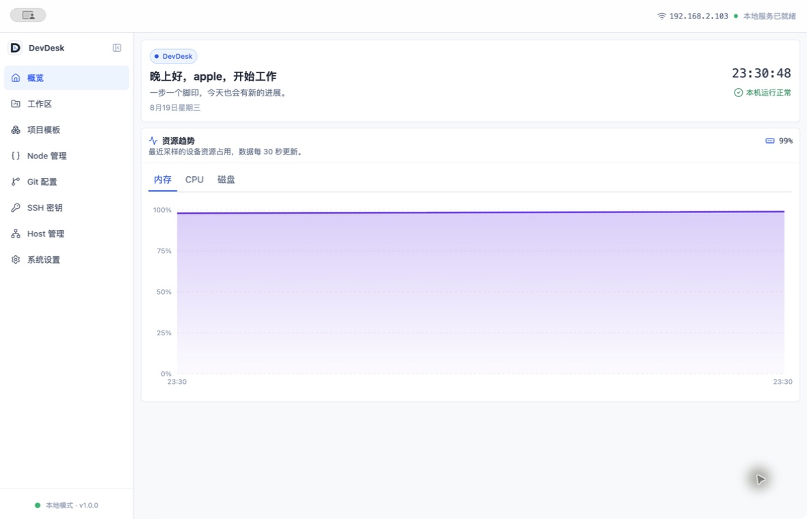
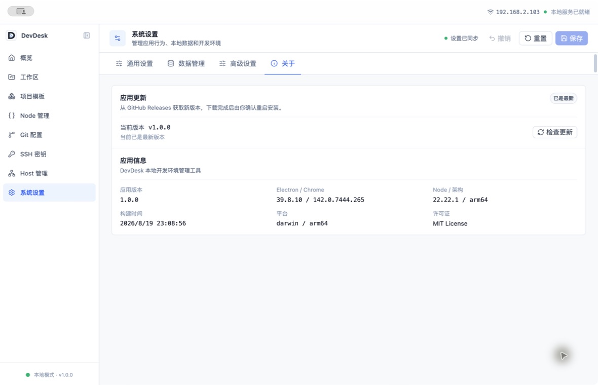

# DevDesk

[](https://github.com/yulingboy/devDesk/releases/latest)
[](https://github.com/yulingboy/devDesk/actions/workflows/release.yml)


DevDesk 是面向个人开发者的本地项目与开发环境工作台。它以工作区为入口，将项目目录、子项目、Git 身份、SSH 密钥、Node 工具链和常用本机配置集中到一个桌面应用中。

[下载最新版本](https://github.com/yulingboy/devDesk/releases/latest) · [查看构建状态](https://github.com/yulingboy/devDesk/actions/workflows/release.yml)



## 产品定位

DevDesk 围绕三个对象组织日常开发环境：

- **工作区**：对应一个本机一级目录，并绑定该目录使用的 Git 身份和 SSH 密钥。
- **项目**：工作区列表只展示一级目录；Java、Python、Go、Node.js 等嵌套工程作为子项目归入一级项目，项目和子项目均可维护备注。
- **环境**：集中查看和管理 Node 版本、镜像、包管理器、全局包、缓存及运行时路径。

它不会接管项目代码，也不会把所有项目强行套入同一种前端工作流。项目仍保存在原目录中，DevDesk 只负责发现、组织和连接相关开发配置。

## 核心功能

| 模块       | 能力                                                                                             |
| ---------- | ------------------------------------------------------------------------------------------------ |
| 工作区     | 扫描一级项目、识别嵌套子项目、维护备注、查看 Git 状态、绑定 Git 身份、手动纳入外部项目           |
| 项目入口   | 使用系统文件管理器、Codex、VS Code、Cursor、Windsurf、Zed 或 JetBrains 系列 IDE 打开项目         |
| 项目模板   | 从本地目录复制或通过 Git 浅克隆创建项目，支持在一级项目下创建子项目，失败时自动回滚目标目录      |
| Git 配置   | 管理全局配置和多身份 profile，根据工作区生成 `includeIf` 规则，并查看身份关联的工作区与密钥      |
| SSH 密钥   | 发现现有公钥、生成 ed25519 / RSA 4096 密钥、查看指纹，并在删除前确认关联影响                     |
| Node 管理  | 解析 Node 官方版本索引，通过 nvm 安装、切换和设置默认版本；管理 nrm 镜像、包管理器、全局包和缓存 |
| Hosts      | 维护独立受管区块，支持启停、备份恢复、打开 hosts 文件、刷新 DNS 和访问配置域名                   |
| 系统与设置 | 展示 CPU、内存和磁盘趋势；支持开机自启、托盘驻留、数据导入导出、日志查看及应用更新               |

> Node 版本安装与切换依赖本机可用的 `nvm`，镜像源管理依赖 `nrm`。DevDesk 会先检测依赖状态，不会伪造成功结果；缺少 `nrm` 时可在应用内发起安装。

## 下载与安装

前往 [GitHub Releases](https://github.com/yulingboy/devDesk/releases/latest) 下载对应平台的安装包。

| 平台                | 构建产物                               |
| ------------------- | -------------------------------------- |
| macOS Apple Silicon | `devdesk-<version>-arm64.dmg` / `.zip` |
| macOS Intel         | `devdesk-<version>-x64.dmg` / `.zip`   |
| Windows             | NSIS `.exe` 安装包                     |
| Linux               | `.AppImage`、`.deb` 或 `.snap`         |

当前 macOS Release 尚未完成 Developer ID 签名与 Apple 公证，Gatekeeper 可能阻止直接打开。生产分发前应在 GitHub Actions 中配置签名与公证凭据；对安全来源有疑虑时，建议从源码自行构建。

## 自动更新

打包版本会从 GitHub Releases 检查新版本。应用启动后会在后台检查一次，也可以在“系统设置 → 关于”中手动检查、下载，并在下载完成后确认重启安装。开发模式不会请求更新。



## 技术栈

- [Electron](https://www.electronjs.org/) 39 + [electron-vite](https://electron-vite.org/) 5
- React 19 + React Router 7
- Tailwind CSS v4 + shadcn/ui + Radix UI
- Recharts 3
- TypeScript 5.9 + Vitest 4 + ESLint 9
- electron-builder + electron-updater
- pnpm 11

## 本地开发

环境要求：Node.js `>= 22.12.0`、pnpm `>= 11.0.0`。

```bash
pnpm install
pnpm dev
```

常用命令：

```bash
pnpm lint          # ESLint 检查
pnpm typecheck     # 主进程与渲染进程类型检查
pnpm test          # 运行 Vitest
pnpm build         # 类型检查并构建应用
pnpm build:mac     # 构建 macOS 安装包
pnpm build:win     # 构建 Windows 安装包
pnpm build:linux   # 构建 Linux 安装包
```

## 发布版本

仓库的 [Release 工作流](.github/workflows/release.yml) 会在推送 `v*.*.*` 标签后，分别在 macOS、Windows 和 Linux runner 上构建安装包，随后创建 GitHub Release。

```bash
pnpm version patch --no-git-tag-version
git add package.json pnpm-lock.yaml
git commit -m "chore: 发布 v1.0.1"
git tag v1.0.1
git push origin main --tags
```

自动发布使用仓库自带的 `GITHUB_TOKEN`。正式发布 macOS 自动更新前，还需要配置代码签名与公证所需的凭据。

## 数据与日志

- 业务数据保存在 Electron `userData/data` 目录，日志保存在 `userData/logs/main.log`。
- 应用设置页可以打开数据或日志目录，并支持数据导入、导出和恢复。
- 单个日志文件最大 5 MB；主进程、IPC、渲染进程崩溃和 React 未捕获错误使用统一日志入口。
- 数据文件采用串行写入和临时文件替换；检测到损坏的 JSON 时会保留 `.corrupt` 副本并使用安全默认值启动。
- SSH 私钥不会写入 DevDesk 的业务数据。Hosts 只修改带有 DevDesk 标记的受管区块。

## 项目结构

```text
src/
├── main/
│   ├── app/              # 应用生命周期与托盘
│   ├── infrastructure/   # 数据存储、日志、路径和 Shell 环境
│   ├── ipc/              # IPC 注册、校验与处理器
│   ├── services/         # 工作区、Git、SSH、Node、Hosts 等领域服务
│   ├── windows/          # 主窗口与窗口池
│   └── workers/          # 后台任务
├── preload/              # 类型安全的渲染层桥接
├── renderer/             # React 页面、组件和样式
└── shared/               # 共享领域模型与 IPC 契约
tests/                    # 主进程与渲染层测试
docs/screenshots/         # README 截图
```

渲染层路由按 `src/renderer/src/pages/<route>` 组织，共用组件位于 `components/common`，shadcn/ui 基础组件位于 `components/ui`。路径别名为 `@/*`、`@main/*` 和 `@shared/*`。
