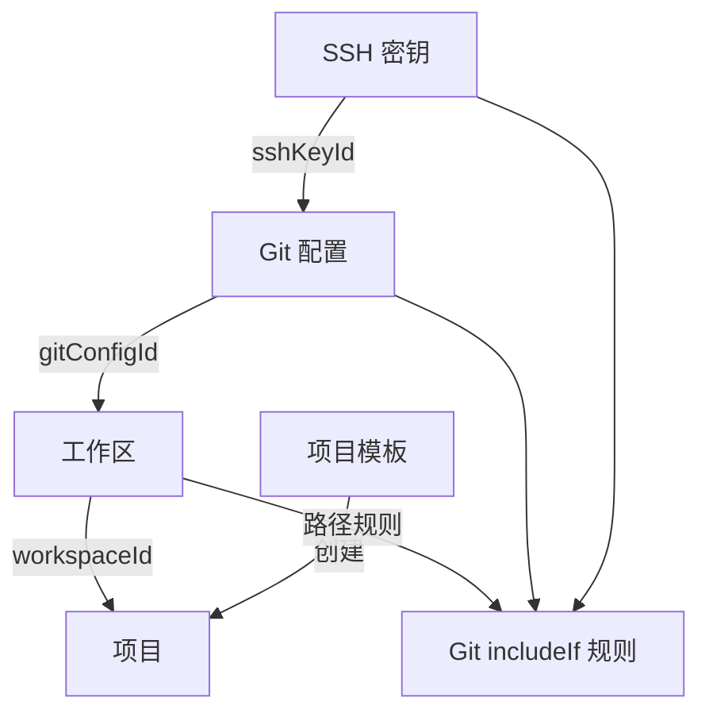
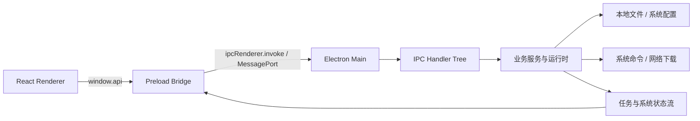

# 开发工坊项目设计文档

> 文档性质：V1.0 产品与技术设计基线。
>
> 更新时间：2026-08-15。
>
> 相关文档：[产品需求文档](./prd.md)。

## 1. 文档目的

本文档用于回答三个问题：

1. 开发工坊解决什么问题，以及面向哪些用户。
2. V1.0 需要提供哪些业务能力和交互规则。
3. 各模块如何通过 Electron 主进程、预加载层、渲染层和本地数据协作。

本文档定义 V1.0 的系统结构、数据边界和关键技术规则。未定事项统一收录在“设计决策事项”中，完成决策后应回写到对应章节。

## 2. 产品概述

### 2.1 产品定位

开发工坊是面向开发者的本机环境管理工具箱。它把开发过程中分散在系统文件、命令行工具、Git 配置、SSH 密钥、Node 版本管理和项目目录中的操作，收敛到一个跨平台桌面应用中。

### 2.2 目标用户

- 需要在多项目之间切换 Git 身份或 SSH 账号的开发者。
- 需要同时维护多个 Node.js 版本、镜像和全局包的前端/Node 开发者。
- 需要管理本地工作区、模板项目和 Hosts 映射的个人开发者。
- 希望通过图形界面检查本机开发环境，而不是逐项执行命令的用户。

### 2.3 产品目标

- 降低本机开发环境配置和切换成本。
- 将高风险系统修改集中在可确认、可回滚的操作中。
- 保留底层真实文件和命令结果的可见性，避免形成不可解释的黑盒。
- 通过本地数据目录和导入导出支持个人配置迁移。

### 2.4 非目标

- 不承担远程服务器、云端账号或团队权限管理。
- 不替代完整 IDE、Git 客户端或 CI/CD 平台。
- 不保存 SSH 私钥内容，应用只记录私钥路径并调用系统工具生成/读取公钥。

## 3. 信息架构

| 模块      | 主要职责                                                         | 主要副作用                                            |
| --------- | ---------------------------------------------------------------- | ----------------------------------------------------- |
| 首页      | 展示主机、CPU、内存、磁盘、网络、Node/Electron 信息              | 后台采样并缓存系统快照                                |
| Host 管理 | 编辑本机 Hosts 受管记录、启用/禁用、打开文件、刷新 DNS、恢复备份 | 写入系统 Hosts 文件，执行平台 DNS 刷新命令            |
| Git 配置  | 管理 Git 身份、邮箱和 SSH 绑定，查看托管配置文件                 | 写入配置存储、用户级 `.gitconfig` 和 include 规则     |
| SSH 密钥  | 发现本机公钥、手动录入、生成、编辑、删除密钥记录                 | 读写 `~/.ssh`，调用 `ssh-keygen`，同步 Git 规则       |
| 工作区    | 管理工作区根目录、绑定 Git 配置、扫描项目、读取项目 Git 状态     | 写入工作区/项目清单，读取项目目录和 Git 状态          |
| 项目模板  | 管理 Git/本地模板，从模板创建项目                                | Git clone 或递归复制目录，创建项目目录和项目记录      |
| Node 管理 | 安装/切换/删除 Node，维护镜像、包管理器、全局包和缓存            | 下载/解压 Node，调用 nvm/npm/pnpm/yarn/bun/nrm 等命令 |
| 系统设置  | 通用、数据、环境检测、高级和关于信息                             | 修改运行时设置、数据目录、日志、开机自启、导入导出    |

## 4. 核心用户流程

### 4.1 首次启动

1. 主进程读取设置，建立默认数据目录和日志配置。
2. 注册 IPC handler，启动系统概览后台采样和系统托盘。
3. 创建安全的主窗口，渲染层通过 preload bridge 初始化 API。
4. 首页优先读取已有系统快照；没有快照时读取实时系统信息。
5. 用户可以进入“环境检测”检查 Git、Node、nvm、包管理器、SSH、Python、Docker 等工具。

### 4.2 配置 Git 身份与工作区

1. 在 SSH 密钥页生成、发现或手动录入密钥。
2. 在 Git 配置页创建身份，填写名称、用户名、邮箱并选择 SSH 密钥。
3. 在工作区页创建工作区，选择根目录并绑定 Git 配置。
4. 应用生成每个 Git 配置对应的托管 profile 文件。
5. 应用在用户级 `.gitconfig` 中维护统一 include 入口，并按工作区路径生成 `includeIf gitdir` 规则。
6. 项目在对应工作区内执行 Git 操作时，自动使用匹配的身份和 SSH 命令。

### 4.3 从模板创建项目

1. 用户维护一个 Git 仓库模板或本地目录模板。
2. 在工作区中选择模板和项目名称。
3. Git 模板使用非交互式浅克隆；本地模板递归复制并过滤 `node_modules`、`dist`、`.git` 等目录。
4. 创建失败时删除半成品目录，避免目录已经创建但项目清单没有记录。
5. 创建成功后把新项目写入项目清单，并可继续读取其 Git 分支和脏状态。

### 4.4 安装 Node 版本

1. Node 管理页加载远程版本索引，支持关键字、LTS/Current 筛选和缓存。
2. 用户发起安装后，主进程创建持久化任务记录。
3. 安装任务在 worker 中执行下载、重试、校验、解压和目录写入。
4. 主进程通过任务流推送进度、日志和最终状态。
5. 安装完成后可切换当前版本、设置默认版本或删除非当前版本。
6. 当前版本、默认版本、镜像、环境路径和缓存大小在 Node 管理页汇总展示。

### 4.5 Hosts 维护

1. 应用读取系统 Hosts，优先识别自己的受管区块。
2. 用户新增或编辑 IPv4 + 域名记录，可设置启用状态和备注。
3. 首次保存前备份原始 Hosts；保存时只维护应用受管区块。
4. 用户可以打开系统 Hosts 文件、恢复备份或刷新 DNS 缓存。

### 4.6 数据迁移

1. 用户可以选择自定义数据目录。
2. 应用先迁移数据文件，再切换运行时数据目录，避免半切换状态。
3. 导出/导入范围包含设置、Git 配置、SSH 密钥元数据、工作区、项目、Node 状态、系统快照和 Hosts 备份；项目模板和环境缓存快照是否纳入由产品决策确定。
4. 导入时只恢复可持久化设置，不把 `about`、缓存大小等运行时展示字段写回配置。

## 5. 领域模型

### 5.1 实体

| 实体                | 关键字段                                                                          | 说明                                            |
| ------------------- | --------------------------------------------------------------------------------- | ----------------------------------------------- |
| `SSHKey`            | `id`, `name`, `algorithm`, `source`, `publicKey`, `fingerprint`, `privateKeyPath` | 私钥只保存路径；`privateKeyExists` 是运行时字段 |
| `GitConfig`         | `id`, `name`, `username`, `email`, `sshKeyId`                                     | 一个 Git 身份可以绑定一个 SSH 密钥              |
| `Workspace`         | `id`, `name`, `rootPath`, `description`, `gitConfigId`                            | 工作区名称和根路径要求唯一                      |
| `Project`           | `id`, `workspaceId`, `name`, `path`                                               | 项目由扫描或模板创建产生                        |
| `ProjectTemplate`   | `id`, `name`, `description`, `type`, `source`                                     | `type` 为 `git` 或 `local`                      |
| `HostRecord`        | `id`, `ip`, `domain`, `enabled`, `remark`                                         | 界面与主进程均校验 IPv4 和域名格式            |
| `NodeManagerState`  | `config`, `installs`, `tasks`, `releaseCache`                                     | Node 安装记录、任务和版本索引缓存               |
| `StoredAppSettings` | `general`, `data`, `advanced`, `node`                                             | 只保存用户配置，不保存运行时统计                |

### 5.2 关系

### 5.3 约束与一致性规则

- 名称类字段在写入前裁剪空格，并进行大小写不敏感的唯一性校验。
- 删除 SSH 密钥前展示受影响的 Git 配置；删除后自动解除悬空引用。
- 删除工作区时同时删除该工作区下的项目记录。
- 工作区绑定不存在的 Git 配置时拒绝保存。
- 当前使用中的 Node 版本不能直接删除。
- Git 模板创建禁用交互式凭据提示，失败时清理目标目录。
- 普通读取尽量保持无副作用，发现型 SSH 密钥只有显式同步时才回写。

## 6. 技术架构

### 6.1 进程模型

### 6.2 渲染层

- `App` 负责启动占位和 `AppShell` 懒加载。
- `AppShell` 统一挂载主题、Ant Design、反馈上下文、错误边界和路由。
- 路由与侧边栏共享导航定义，业务页面按模块懒加载。
- 页面采用“资源读取 hook + 动作 hook + 页面状态 hook + 展示组件”的拆分方式。
- `window.api` 是由主进程 handler tree 动态推导的代理，业务页面不直接接触 Electron API。

### 6.3 主进程

- 启动运行时负责单实例、设置应用、IPC 注册、托盘、窗口和采样任务。
- IPC 注册入口统一执行来源校验、上下文注入、异常包装和日志记录。
- 文件存储使用 JSON 文件；写入采用临时文件、flush、rename，降低中断造成半文件的概率。
- Node 安装的下载、校验、解压等重 IO 已迁移到 worker，主进程负责任务编排和状态落库。

### 6.4 通信方式

- 普通请求：`ipcRenderer.invoke`，返回统一 RPC 成功/失败结构。
- 长连接状态：MessagePort 流，当前用于 Node 安装任务、系统概览和窗口状态。
- 每条流使用 `sessionId` 管理打开、关闭和资源清理，窗口销毁时释放监听器。

## 7. 数据与文件布局

默认数据目录为 Electron `userData/data`，也可由用户切换到自定义目录。

| 文件                            | 内容                                   |
| ------------------------------- | -------------------------------------- |
| `settings.json`                 | 固定放在基础数据目录的应用设置         |
| `git-configs.json`              | Git 身份列表                           |
| `ssh-keys.json`                 | SSH 公钥和路径元数据                   |
| `workspaces.json`               | 工作区列表                             |
| `projects.json`                 | 项目清单                               |
| `templates.json`                | 项目模板列表                           |
| `node-manager.json`             | Node 管理状态、安装记录和任务          |
| `system-overview-snapshot.json` | 首页最新系统快照                       |
| `env-caches-snapshot.json`      | Node 环境缓存快照                      |
| `hosts.backup`                  | 首次接管 Hosts 前的备份                |
| `git-rules/`                    | 托管 Git profile 和工作区 include 规则 |

敏感性设计：应用不持久化私钥内容；Git profile 可能包含 SSH 私钥路径，数据目录和托管规则目录应按本机用户权限保护。

## 8. 安全、可靠性与平台策略

### 8.1 安全边界

- 主窗口启用 `contextIsolation`、sandbox、`nodeIntegration: false` 和 `webSecurity`。
- preload 只暴露最小 bridge，不把 Node/Electron 原始对象交给渲染层。
- IPC 只接受受管理窗口和受信任渲染来源的调用。
- 外部导航和新窗口请求交给系统浏览器，不在应用窗口加载外部站点。
- Git clone 禁止交互式凭据输入，避免主进程永久等待。

### 8.2 可靠性策略

- JSON 写入采用临时文件替换。
- Node 安装任务持久化状态，支持进度、日志、失败和重试信息。
- 系统采样失败时使用降级数据源或默认值，不能阻断首页。
- 模板创建失败后回滚目录。
- 设置切换数据目录时先迁移、后切换运行时状态。

### 8.3 平台差异

- Hosts 路径、DNS 刷新命令和 nvm 路径按 Windows/macOS/Linux 分支处理。
- Node 安装包根据平台和 CPU 架构选择 `zip` 或 `tar.gz`。
- 开机自启仅在支持的平台和正式安装环境中写入。
- macOS 窗口使用无边框窗口并隐藏系统按钮，由应用自定义标题栏控制。

## 9. 非功能需求

### 9.1 基础要求

- 首屏通过懒加载拆分页面和 UI 依赖。
- 主进程不在窗口线程中执行 Node 安装重 IO。
- 所有系统动作提供可读错误反馈和日志。
- 数据读写尽量可恢复，关键系统修改前保留备份。

### 9.2 验收指标

- 冷启动到首个可交互页面的目标值在首轮安装包基准测试后确定。
- Node 安装任务在下载中断后可重试，且不会留下不可识别的半安装目录。
- 导入导出跨版本兼容，至少保留 schema version 和迁移策略。
- Hosts、Git 全局配置修改前后均能查看来源文件和恢复路径。
- Windows、macOS、Linux 各完成一次真实安装包冒烟测试。

## 10. 设计决策事项

以下事项需在 V1.0 开发范围锁定前完成决策：

1. Hosts 首次接管时对系统中已有 IPv4 行的处理是否需要更强提示和逐条保留策略。
2. 数据导出是否包含项目模板和环境缓存快照，以及导入时如何处理设备相关路径。
3. SSH 私钥路径是否需要额外的权限检查、失效提示和跨设备迁移说明。
4. Git 配置同步失败时，配置记录与真实 `.gitconfig` 规则是否需要事务式回滚。
5. Node 下载源、镜像和全局包安装是否需要代理、证书和网络诊断能力。
6. 项目扫描是否从“工作区根目录第一层”扩展为可配置深度或显式项目注册。
7. 缺失工具的安装是否允许执行远程 shell 脚本，以及如何实施来源校验、授权确认和超时控制。
8. 是否引入匿名遥测，以及相应的数据最小化、用户授权和退出机制。
9. 发布包是否需要代码签名、公证、自动更新和崩溃上报策略。

## 11. 实施顺序

1. 固定 Node/pnpm 版本，补充 README、开发环境说明和 CI。
2. 为 IPC、Hosts、Git 规则同步、Node 安装任务补充跨平台集成测试。
3. 为导入导出数据增加 schema 版本和迁移器。
4. 增加真实 Electron 启动、托盘、窗口状态流和打包安装冒烟测试。
5. 根据冷启动和安装包测量结果继续优化渲染包体和首屏加载。
